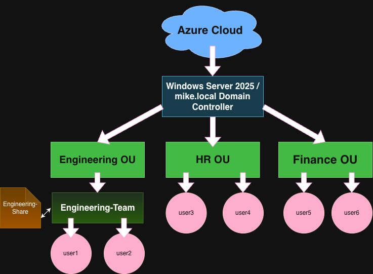

# IT Home Lab
## Overview
Home lab built to develop hands-on IT infrastructure experience in preparation for junior systems administrator roles. Projects cover Windows Server, Active Directory, Linux server administration, and cloud deployment on Microsoft Azure.
## Project 1: Windows Server & Active Directory

### Environment
- Platform: Microsoft Azure
- OS: Windows Server 2025 Datacenter
- Domain: mike.local

### What I Configured
- Promoted server to Domain Controller
- Created Organizational Units: Engineering, HR, Finance
- Created user accounts across each department
- Configured Group Policy Object (Security Policy) enforcing:
  - Minimum password length: 10 characters
  - Password complexity: Enabled
  - Maximum password age: 90 days
  - Screen lock after 600 seconds (10 minutes)
- Set up shared folder (Engineering-Share) with permission-based access
- Created security group (Engineering-Team) and managed membership

### IT Tasks Simulated
- Disabled and re-enabled user accounts (employee termination/reinstatement)
- Reset user passwords with forced change at next logon
- Managed security group membership
- Configured shared folder access control by department

### Network Diagram

## Project 2: Linux Server Administration

### Environment
- Platform: Microsoft Azure
- OS: Ubuntu Server 24.04 LTS (VM Size: B2ats_v2)
- Hostname: linux-server-01
- Access: SSH with key-based authentication

### Organizational Structure
- Departments: DevOps, Marketing, Security
- Users distributed across departments with group-based access control

### What I Configured

**User & Group Administration**
- Created department groups (devops, marketing, security) using `groupadd`
- Provisioned user accounts with home directories, Bash shell, and group assignments using `useradd`
- Managed passwords and enforced password expiration on first login using `passwd -e`

**File Permissions & Access Control**
- Created shared department directories under `/company/`
- Set group ownership with `chgrp` and enforced `770` permissions with `chmod`
- Verified cross-department access isolation (users denied access to other departments' directories)

**Service Management**
- Installed and managed Nginx web server using `apt` and `systemctl`
- Practiced full service lifecycle: start, stop, restart, enable, disable
- Monitored service status and logs through `systemctl status` and `journalctl`

**Bash Scripting — Automated Onboarding**
- Wrote a bulk user creation script using colon-delimited user:department pairs
- Implemented idempotency checks (`id` command) to prevent duplicate account creation
- Automated temporary password assignment with forced expiration via `chpasswd` and `passwd -e`
- Used Bash parameter expansion (`%%`, `##`) to parse structured input strings

**Bash Scripting — Automated Backups**
- Wrote a backup script that archives `/company/` into timestamped `.tar.gz` files
- Implemented success/failure validation using exit codes (`$?`)
- Added automatic cleanup of backups older than 30 days using `find -mtime -delete`

**Log Analysis**
- Queried system logs using `journalctl` with service filtering (`-u`) and time filtering (`--since`)
- Reviewed authentication logs in `/var/log/auth.log` to audit sudo usage and user activity
- Identified service lifecycle events, cron jobs, and authentication records across log sources

### IT Tasks Simulated
- Employee onboarding (bulk account creation with department assignment)
- File access control enforcement and cross-department isolation testing
- Service installation, management, and troubleshooting
- Automated backup with retention policy
- Security auditing through log analysis

### Scripts
- [create_users.sh](scripts/create_users.sh) — Automated employee onboarding
- [backup.sh](scripts/backup.sh) — Automated backup with retention policy
